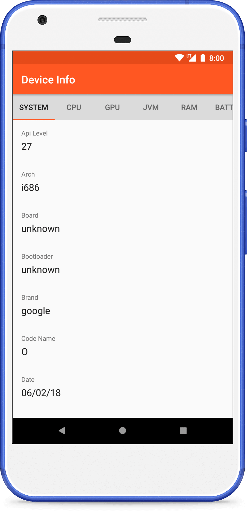
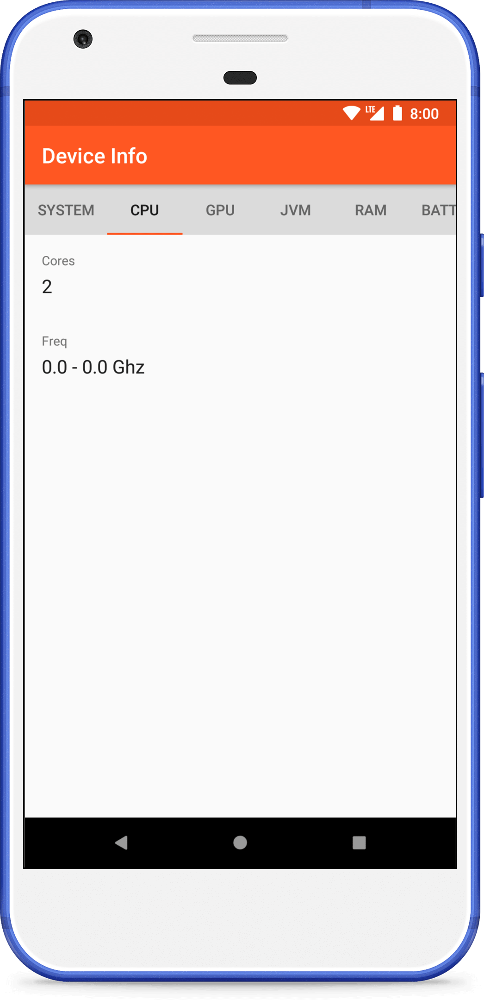
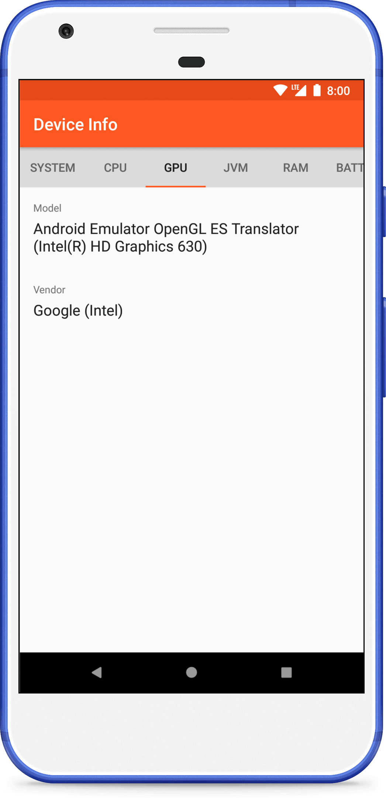
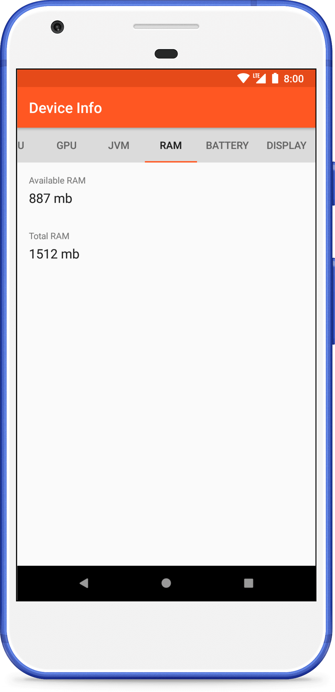
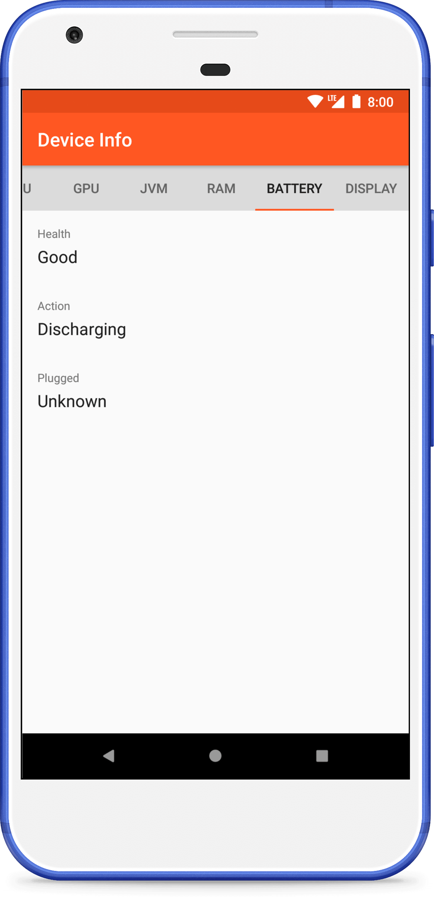

## About

Demo app for displaying information about Android device.
contact for work, mail: chunhthanhde.dev@gmail.com

__Available information about device__

| Section | Values |
| --- | --- |
| `System` | Api Level, Arch, Board, Bootloader, Brand, Code Name, Date, Fingerprint, Hardware, Host, Kernel Version, Manufacturer, Model, Product, Release Version, Type, User |
| `CPU` | Cores, Frequency |
| `GPU` | Model, Vendor |
| `JVM` | JVM |
| `RAM` | Available RAM, Total RAM |
| `Battery` | Health, Action, Plugged |
| `Display` | Density DPI, Density, Display, Height Pixels, Scaled Density DPI, Width Pixels, XDPI, YDPI |

## Screenshots

 

  
  
  
  
  

## This application uses open source code contributed by:

* [@fartem](https://github.com/fartem) as Artem Fomchenkov
* [@artem385](https://github.com/artem385) as Artem Fomchenkov

###### original path: https://github.com/fartem/android-device-info
